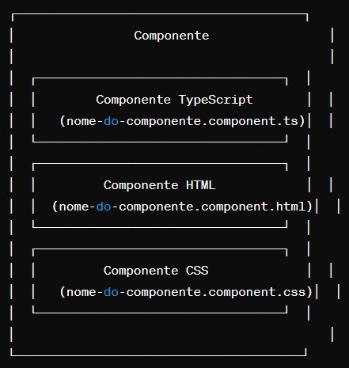

# Componentes com Angular

> Os componentes são a unidade básica de construção em Angular, permitindo uma organização modular e reutilizável do código em uma aplicação web. Eles são essenciais para criar interfaces de usuário dinâmicas e interativas em aplicações Angular.

### Entendendo os Componentes
Em Angular, os componentes são blocos fundamentais de construção de uma aplicação, responsáveis por controlar partes específicas da interface do usuário (UI). Cada componente encapsula seu próprio conjunto de funcionalidades, incluindo lógica, estrutura HTML e estilos CSS relacionados.

Os componentes no Angular seguem uma estrutura lógica de Modelo-Visualização-Componente (MVC), onde:

- **Modelo**: Representa os dados do componente.
- **Visualização**: É a camada de apresentação, definida em um template HTML.
- **Componente**: É a classe TypeScript que define o comportamento e a lógica do componente.

Principais características dos componentes em Angular:

1. **Reutilizáveis**: Os componentes são reutilizáveis e podem ser facilmente compartilhados e composto para construir interfaces de usuário complexas.

2. **Encapsulados**: Cada componente é encapsulado, o que significa que ele possui sua própria lógica e estado interno, reduzindo o acoplamento entre diferentes partes da aplicação.

3. **Comunicação entre Componentes**: Os componentes podem se comunicar entre si por meio de entradas e saídas (inputs e outputs), eventos e serviços compartilhados.

4. **Ciclo de Vida**: Os componentes possuem um ciclo de vida que inclui eventos como `ngOnInit`, `ngOnChanges`, `ngOnDestroy`, entre outros, que permitem a execução de lógica em momentos específicos durante a vida do componente.

5. **Decorações**: Os componentes são decorados com o decorador `@Component`, onde são definidas metadados como o seletor, template, estilos, entre outros.

No contexto de um projeto Angular, o diretório `src` (source) é onde residem os arquivos fonte do projeto, ou seja, os arquivos que compõem a aplicação em si. Este diretório é fundamental para o desenvolvimento e construção da aplicação Angular. 

Dentro do diretório `src`, é comum encontrar os seguintes tipos de arquivos:

1. **Arquivos TypeScript**: São os arquivos com extensão `.ts` que contêm o código fonte escrito em TypeScript. Estes arquivos são transpilados para JavaScript durante o processo de compilação.

2. **Arquivos HTML**: São os arquivos com extensão `.html` que contêm os templates HTML utilizados pelos componentes da aplicação Angular.

3. **Arquivos CSS ou SCSS**: São os arquivos de estilo com extensão `.css` ou `.scss` (Sass) que definem a aparência visual da aplicação.

4. **Arquivos de Imagem e Outros Recursos**: Podem incluir arquivos de imagem, fontes, arquivos de configuração, entre outros recursos necessários para a aplicação.

Além disso, é comum encontrar arquivos relacionados ao ambiente de desenvolvimento, como:

5. **Arquivos de Testes**: Arquivos de teste unitário e de integração, geralmente localizados no diretório `src/app` ou em subdiretórios específicos.

6. **Arquivos de Configuração**: Arquivos de configuração para ferramentas de build, como o `angular.json`, `tsconfig.json` e `package.json`.

7. **Arquivos de Tradução (i18n)**: Arquivos relacionados à internacionalização (tradução) da aplicação.

Fora do diretório `src`, é comum encontrar arquivos relacionados à configuração e ferramentas de desenvolvimento, tais como:

1. **node_modules**: Este diretório contém as dependências do projeto instaladas pelo npm ou yarn.

2. **Arquivos de Configuração**: Arquivos de configuração do projeto, como o `angular.json`, `tsconfig.json`, `package.json`, entre outros.

3. **Arquivos de Build**: Arquivos gerados durante o processo de construção (build) da aplicação, como os arquivos JavaScript, CSS e HTML otimizados para produção.

Resumindo, os arquivos dentro do diretório `src` constituem o código fonte da aplicação Angular, enquanto os arquivos fora do diretório `src` são geralmente relacionados à configuração e ferramentas de desenvolvimento.

### Criando Componentes
Para criar um novo componente em Angular, podemos utilizar a CLI (Interface de Linha de Comando) do Angular, que facilita muito esse processo. Abra um terminal e execute o seguinte comando:

```bash
ng generate component nome-do-componente
```

Isso criará uma nova pasta com o nome do componente dentro do diretório `src/app`, contendo todos os arquivos necessários para o componente, incluindo TypeScript, HTML e CSS.

Dentro da pasta do componente recém-criado, teremos os seguintes arquivos principais:

- `nome-do-componente.component.ts`: Este arquivo contém a lógica do componente em TypeScript, incluindo a classe do componente.
- `nome-do-componente.component.html`: Este arquivo contém o template HTML do componente, ou seja, a estrutura da interface do usuário.
- `nome-do-componente.component.css`: Este arquivo contém os estilos CSS específicos do componente.

Por padrão, os estilos definidos em um arquivo `.css` associado a um componente Angular são encapsulados, ou seja, se aplicam apenas ao componente em questão e não afetam outros componentes. Isso é alcançado automaticamente pelo Angular por meio de técnicas de emulação de encapsulamento de estilo.

Ao criar um componente em Angular, é importante seguir alguns contratos para garantir que o componente funcione corretamente:

- **Selector Único**: O seletor (selector) do componente deve ser único e não deve coincidir com os seletores de outros componentes.
- **Exportação da Classe**: A classe do componente deve ser exportada para que possa ser importada e utilizada em outros módulos ou componentes, se necessário.
- **Decoração do Componente**: A classe do componente deve ser decorada com o decorador `@Component`, onde são definidos metadados como seletor, template, estilos, entre outros.


Por padrão, os componentes Angular são automaticamente registrados no módulo em que foram criados. Portanto, não é necessário registrar explicitamente um componente recém-criado em um módulo, a menos que você deseje usá-lo em outros módulos.



Este é um exemplo básico da arquitetura de um componente em um projeto Angular:
- O componente é a entidade principal que encapsula a lógica, a interface do usuário e os estilos relacionados.
- O Componente TypeScript (nome-do-componente.component.ts) contém a classe do componente, onde a lógica do componente é implementada.
- O Componente HTML (nome-do-componente.component.html) contém o template HTML associado ao componente, que define a estrutura da interface do usuário.
- O Componente CSS (nome-do-componente.component.css) contém os estilos CSS específicos do componente, que definem a aparência visual do componente.

Esses três arquivos trabalham juntos para formar o componente Angular e são organizados dentro de uma pasta específica com o nome do componente.

### Componentes Reutilizáveis
Para criar a estrutura de um componente reutilizável em Angular, é importante seguir algumas práticas recomendadas. 

O primeiro passo é utilizar o Angular CLI para criar um novo componente. Abra um terminal e execute o seguinte comando:

```bash
ng generate component nome-do-componente
```

Isso criará uma nova pasta com o nome do componente dentro do diretório `src/app`, contendo todos os arquivos necessários para o componente.

Dentro da pasta do componente recém-criado, teremos os seguintes arquivos principais:

- `nome-do-componente.component.ts`: Este arquivo contém a classe do componente em TypeScript.
- `nome-do-componente.component.html`: Este arquivo contém o template HTML do componente.
- `nome-do-componente.component.css`: Este arquivo contém os estilos CSS específicos do componente.

Para tornar o componente reutilizável e interativo, podemos definir inputs e outputs. Inputs permitem que dados sejam passados para o componente, enquanto outputs permitem que eventos sejam emitidos pelo componente.

- Definir Inputs: No componente TypeScript (`nome-do-componente.component.ts`), utilize o decorador `@Input()` para definir propriedades que receberão dados do componente pai.
- Definir Outputs: No componente TypeScript, utilize o decorador `@Output()` para definir eventos que serão emitidos pelo componente para o componente pai.

Por padrão, os estilos definidos em um arquivo `.css` associado a um componente Angular são encapsulados, aplicando-se apenas ao componente em questão. Isso evita conflitos de estilos em toda a aplicação.

Para que o componente possa ser importado e utilizado em outros módulos ou componentes, é necessário exportar a classe do componente no arquivo `nome-do-componente.component.ts`.

Por padrão, os componentes Angular são automaticamente registrados no módulo em que foram criados. Portanto, não é necessário registrar explicitamente um componente recém-criado em um módulo, a menos que você deseje usá-lo em outros módulos.

Depois de criar o componente, você pode usá-lo em qualquer outro componente ou template HTML da seguinte maneira:

```html
<app-nome-do-componente [inputProp]="valor" (outputEvento)="funcaoNoPai($event)"></app-nome-do-componente>
```

Com esses passos, podemos criar a estrutura básica de um componente reutilizável em Angular, permitindo que ele seja facilmente utilizado em toda a sua aplicação.

### O que é necessário saber?
Nesta secção irei abordar alguns conceitos e recursos que acredito serem necessários para começar a utilizar o Angular de forma eficiente.

- Interpolação de dados:

    A interpolação de dados é uma técnica fundamental em Angular que permite a exibição dinâmica de dados em templates HTML. Funciona de forma muito simples e poderosa, permitindo que você incorpore valores de variáveis do componente diretamente no template HTML.

    Para realizar a interpolação de dados em Angular, você utiliza a sintaxe de interpolação, que consiste em colocar uma expressão entre chaves duplas (`{{ }}`) dentro de um template HTML. Por exemplo:

    ```html
    <p>Olá, {{ nome }}</p>
    ```

    Neste exemplo, `{{ nome }}` é uma expressão de interpolação que será substituída pelo valor da variável `nome` definida no componente correspondente.

    Quando o Angular compila o template, ele avalia as expressões de interpolação e as substitui pelo valor atual das variáveis correspondentes no componente. Se o valor da variável `nome` mudar no componente, a expressão de interpolação será atualizada automaticamente no template para refletir essa mudança.

    Além de simplesmente exibir valores de variáveis, a interpolação de dados em Angular também suporta a chamada de métodos e a avaliação de expressões JavaScript mais complexas dentro das chaves duplas. Por exemplo:

    ```html
    <p>A soma de 1 + 1 é {{ 1 + 1 }}</p>
    ```

    Isso resultaria em:

    ```
    A soma de 1 + 1 é 2
    ```

- Estilo global vs scoped

    Estilo global e estilo scoped são duas abordagens diferentes para aplicar estilos CSS em uma aplicação Angular.

    Estilo Global:

    - **Definição**: Estilo global refere-se a estilos CSS que são aplicados globalmente em toda a aplicação, afetando todos os elementos HTML em todas as páginas.
    - **Uso**: Estilos globais são comumente usados para definir estilos de alto nível, como estilos de reset (normalização) ou estilos básicos para elementos HTML padrão.
    - **Exemplo**: Um arquivo `styles.css` na pasta `src` é um exemplo de estilo global em um projeto Angular. Este arquivo é incluído no `angular.json` e aplicado a todas as páginas da aplicação.
    - **Aplicação**: Os estilos globais são aplicados diretamente no arquivo de estilo global (`styles.css`), sem encapsulamento, o que significa que podem afetar todos os elementos da página.

    Estilo Scoped:

    - **Definição**: Estilo scoped refere-se a estilos CSS que são encapsulados e aplicados apenas a um componente específico e seus elementos filhos.
    - **Uso**: Estilos scoped são úteis para definir estilos específicos para um componente sem afetar outros componentes na aplicação.
    - **Exemplo**: Um arquivo CSS associado a um componente (por exemplo, `nome-do-componente.component.css`) é um exemplo de estilo scoped em um projeto Angular. Os estilos definidos neste arquivo são aplicados apenas ao template HTML do componente correspondente.
    - **Aplicação**: Os estilos scoped são aplicados apenas ao componente ao qual estão associados e não afetam outros componentes na página. Isso é alcançado por meio de técnicas de emulação de encapsulamento de estilo, como a geração de identificadores exclusivos para cada componente.

    Escolha entre Estilo Global e Scoped:

    - **Estilo Global**: Use para estilos que devem ser aplicados globalmente em toda a aplicação.
    - **Estilo Scoped**: Use para estilos que devem ser aplicados apenas a um componente específico e seus elementos filhos, garantindo o encapsulamento e a modularidade do componente.

- Múltiplos estilos no componente

    Quando se trata de estilos em um componente Angular, é possível utilizar múltiplos estilos de várias maneiras para estilizar o componente de forma mais flexível e organizada.

    - **Arquivos CSS Múltiplos**:
        - Você pode dividir os estilos do seu componente em vários arquivos CSS para melhor organização e manutenção.
        - Por exemplo, além do arquivo CSS principal (`nome-do-componente.component.css`), você pode criar outros arquivos CSS para estilos específicos, como `nome-do-componente.header.css`, `nome-do-componente.footer.css`, etc.
        - Em seguida, você pode importar esses arquivos CSS adicionais no arquivo principal do componente para aplicar estilos específicos conforme necessário.

    - **Estilos Inline**:
        - Além de usar arquivos CSS externos, você também pode definir estilos diretamente no template HTML do componente usando estilos inline.
        - Isso é útil para estilizar elementos específicos de forma rápida e simples, especialmente quando os estilos são específicos apenas para aquele componente e não precisam ser reutilizados em outros lugares.

    - **Estilos Condicionais**:
        - Dependendo das condições específicas do componente, você pode aplicar estilos condicionais usando classes CSS dinamicamente adicionadas ou removidas com base em variáveis ou estados do componente.
        - Por exemplo, você pode usar a diretiva `ngClass` para aplicar estilos com base em condições específicas no template HTML.

    - **Estilos Inline Condicionais**:
        - Além de aplicar estilos inline, você pode aplicar estilos inline condicionalmente usando diretivas estruturais como `ngStyle`.
        - Com `ngStyle`, você pode calcular dinamicamente os estilos com base em expressões no componente e aplicá-los diretamente aos elementos no template HTML.

    Escolha entre Múltiplos Estilos:

    - Use arquivos CSS múltiplos para organizar e modularizar os estilos do componente.
    - Use estilos inline para estilização rápida e simples de elementos específicos no template HTML.
    - Use estilos condicionais e estilos inline condicionais para aplicar estilos dinamicamente com base em variáveis ou estados do componente.

- Comunicação entre componentes
    No Angular, os componentes podem se comunicar entre si por meio de vários mecanismos, como inputs e outputs, serviços compartilhados, roteamento e até mesmo eventos nativos do JavaScript.

    Vamos explorar algumas das maneiras comuns pelas quais os componentes podem se comunicar:

    - **Inputs e Outputs**:
        - Os componentes podem se comunicar passando dados de um componente pai para um componente filho através de inputs e recebendo eventos de um componente filho de volta para um componente pai através de outputs. Isso é feito por meio de bindings de dados, onde os dados fluem de cima para baixo (inputs) e de baixo para cima (outputs) na hierarquia de componentes.

    - **Serviços Compartilhados**:
        - Os componentes podem compartilhar dados e funcionalidades comuns por meio de serviços compartilhados. Um serviço é uma classe Angular que pode ser injetada em vários componentes, permitindo que eles compartilhem dados e comportamentos de forma eficiente.

    - **Roteamento**:
        - Os componentes podem se comunicar indiretamente por meio do roteamento. O roteamento em Angular permite que diferentes componentes sejam exibidos com base na URL atual, permitindo que os componentes interajam com base nas rotas navegadas pelo usuário.

    - **Eventos Nativos do JavaScript**:
        - Os componentes podem se comunicar por meio de eventos nativos do JavaScript, como eventos de clique, teclado ou mouse. Os componentes podem disparar eventos personalizados e ouvir eventos em outros componentes para realizar ações específicas com base nas interações do usuário.

    A integração entre componentes é uma parte fundamental do desenvolvimento de aplicativos em Angular, permitindo uma comunicação eficaz e flexível entre os diferentes elementos da aplicação.

- Como inputar valores para os compoentes

    Em Angular, os valores são inseridos em um componente usando inputs. Inputs são propriedades decoradas com `@Input()` em um componente filho que permitem a passagem de dados de um componente pai para um componente filho. É a maneira padrão e recomendada de passar valores para um componente.

    Agora, para poder inputar valores para um componente em Angular, siga os seguintes passos:

    1. **Definir um Input no Componente Filho**:
        - No componente filho (o componente que receberá os valores), defina uma propriedade com o decorador `@Input()` antes dela. Por exemplo:
        
        ```typescript
        import { Component, Input } from '@angular/core';

        @Component({
            selector: 'app-meu-componente',
            templateUrl: './meu-componente.component.html',
            styleUrls: ['./meu-componente.component.css']
        })
        export class MeuComponenteComponent {
            @Input() valor: string;
        }
        ```

    2. **Passar o Valor do Componente Pai para o Componente Filho**:
        - No template HTML do componente pai, use o nome do input definido no componente filho e vincule-o a uma expressão que represente o valor que você deseja passar. Por exemplo:
   
        ```html
        <app-meu-componente [valor]="valorDoPai"></app-meu-componente>
        ```

        Onde `valorDoPai` é uma variável ou expressão no componente pai.

    3. **Utilizar o Valor no Componente Filho**:
    - Dentro do template HTML ou na lógica do componente filho, você pode acessar o valor passado através do input normalmente. Por exemplo, no template HTML do componente filho:

    ```html
    <p>O valor recebido é: {{ valor }}</p>
    ```

    Isso exibirá o valor passado do componente pai para o componente filho.

- Maneiras de passar valores para os componentes

    1. Inputs (Entradas):

        - **Definição**: Inputs são propriedades decoradas com `@Input()` em um componente filho que permitem a passagem de dados de um componente pai para um componente filho.

        **Exemplo**:

        - Componente Filho (meu-componente.component.ts):

            ```typescript
            import { Component, Input } from '@angular/core';

            @Component({
            selector: 'app-meu-componente',
            templateUrl: './meu-componente.component.html',
            styleUrls: ['./meu-componente.component.css']
            })
            export class MeuComponenteComponent {
            @Input() valor: string;
            }
            ```
        - Componente Pai (componente-pai.component.html):
            ```html
            <app-meu-componente [valor]="valorDoPai"></app-meu-componente>
            ```
        Onde `valorDoPai` é uma variável ou expressão no componente pai.

    2. Outputs (Saídas):

        - **Definição**: Outputs são eventos emitidos por um componente filho que permitem que o componente pai reaja a ações ocorridas no componente filho.

        **Exemplo**:
        - Componente Filho (meu-componente.component.ts):
            ```typescript
            import { Component, Output, EventEmitter } from '@angular/core';

            @Component({
            selector: 'app-meu-componente',
            templateUrl: './meu-componente.component.html',
            styleUrls: ['./meu-componente.component.css']
            })
            export class MeuComponenteComponent {
            @Output() cliqueBotao = new EventEmitter<void>();

            onClickBotao() {
                this.cliqueBotao.emit();
            }
            }
            ```
        - Componente Pai (componente-pai.component.html):
            ```html
            <app-meu-componente (cliqueBotao)="funcaoNoPai()"></app-meu-componente>
            ```
        Onde `funcaoNoPai()` é uma função definida no componente pai que será executada quando o evento for emitido pelo componente filho.

    3. Serviços Compartilhados:
        - **Definição**: Os serviços são classes Angular que podem ser injetadas em componentes para compartilhar dados e funcionalidades entre eles.

        **Exemplo**:
        - Serviço (meu-servico.service.ts):

            ```typescript
            import { Injectable } from '@angular/core';

            @Injectable({
            providedIn: 'root'
            })
            export class MeuServicoService {
            valorCompartilhado: string;
            }
            ```

        - Componente Filho (meu-componente.component.ts):

            ```typescript
                import { Component } from '@angular/core';
                import { MeuServicoService } from './meu-servico.service';

                @Component({
                selector: 'app-meu-componente',
                templateUrl: './meu-componente.component.html',
                styleUrls: ['./meu-componente.component.css']
                })
                export class MeuComponenteComponent {
                constructor(private meuServico: MeuServicoService) {}

                ngOnInit() {
                    this.meuServico.valorCompartilhado = 'Valor do Serviço';
                }
                }
            ```
        - Componente Pai (componente-pai.component.ts):
            ```typescript
                import { Component } from '@angular/core';
                import { MeuServicoService } from './meu-servico.service';

                @Component({
                selector: 'app-componente-pai',
                templateUrl: './componente-pai.component.html',
                styleUrls: ['./componente-pai.component.css']
                })
                export class ComponentePaiComponent {
                constructor(private meuServico: MeuServicoService) {}

                valorRecebido: string = this.meuServico.valorCompartilhado;
                }
            ```

    4. ViewChild e ContentChild:

        - **Definição**: `ViewChild` e `ContentChild` são decoradores que permitem acessar diretamente instâncias de elementos filhos de um componente para interação direta.

        **Exemplo**:
        - Componente Pai (componente-pai.component.html):
            ```html
            <app-meu-componente #meuComponente></app-meu-componente>
            ```
        - Componente Pai (componente-pai.component.ts):

            ```typescript
                import { Component, ViewChild, AfterViewInit } from '@angular/core';
                import { MeuComponenteComponent } from './meu-componente.component';

                @Component({
                selector: 'app-componente-pai',
                templateUrl: './componente-pai.component.html',
                styleUrls: ['./componente-pai.component.css']
                })
                export class ComponentePaiComponent implements AfterViewInit {


                @ViewChild('meuComponente', { static: true }) meuComponente: MeuComponenteComponent;

                ngAfterViewInit() {
                    console.log(this.meuComponente);
                }
                }
            ```
            Neste exemplo, `meuComponente` é uma instância do componente filho `MeuComponenteComponent` que pode ser acessada e interagida diretamente no componente pai.

### Binding Syntax
Claro, aqui está um resumo sobre as Syntax Bindings em Angular:

### Bindings Syntax em Angular:

- **Definição**: As bindings syntax em Angular são usadas para conectar os componentes, templates HTML e o código TypeScript de forma dinâmica, permitindo a troca de dados e ações entre eles.

- **Tipos de Bindings**:
  1. **Interpolação (`{{ }}`)**: Usada para renderizar valores de variáveis e expressões diretamente no template HTML.
  2. **Property Binding (`[ ]`)**: Utilizada para definir valores de atributos HTML e propriedades de componentes baseadas em variáveis ou expressões.
  3. **Event Binding (`( )`)**: Permite que os elementos HTML disparem eventos que podem ser capturados e tratados por métodos no componente.
  4. **Two-Way Binding (`[( )]`)**: Combina property binding e event binding, permitindo a atualização bidirecional de valores entre o template HTML e o código TypeScript do componente.

- **Sintaxe**:
  - **Interpolação**: `<p>{{ valor }}</p>`
  - **Property Binding**: `<input [value]="valor">`
  - **Event Binding**: `<button (click)="funcao()">Clique</button>`
  - **Two-Way Binding**: `<input [(ngModel)]="valor">`

- **Uso**:
  - As bindings syntax são utilizadas principalmente nos templates HTML dos componentes Angular para interligar dados e eventos entre o código TypeScript e a interface do usuário.
  - Elas permitem que os componentes sejam dinâmicos e reativos às interações do usuário e às mudanças de estado no aplicativo.

- **Benefícios**:
  - Facilita a criação de interfaces de usuário dinâmicas e interativas.
  - Permite uma comunicação eficaz entre componentes e o código TypeScript.
  - Torna o desenvolvimento mais produtivo e eficiente, reduzindo a necessidade de manipulação direta do DOM.

### Style Bindings
O Style Binding em Angular é uma técnica que permite aplicar estilos CSS de forma dinâmica aos elementos HTML com base em expressões no código TypeScript do componente. Isso proporciona uma maneira flexível de alterar a aparência de um elemento com base em condições ou valores de variáveis.

**Funcionamento do Style Binding:**
- **Sintaxe**: O style binding é definido usando `[style.nomeDaPropriedade]` no template HTML, onde `nomeDaPropriedade` é o nome da propriedade CSS que você deseja definir dinamicamente.

- **Expressões**: A expressão atribuída ao style binding pode ser uma variável, uma expressão de condição ou uma função que retorna um valor. O valor resultante é então aplicado como o valor da propriedade CSS.

**Exemplo de Uso:**

Suponha que você tenha uma variável `corFundo` no componente que contém a cor de fundo desejada:

```typescript
import { Component } from '@angular/core';

@Component({
  selector: 'app-meu-componente',
  templateUrl: './meu-componente.component.html',
  styleUrls: ['./meu-componente.component.css']
})
export class MeuComponenteComponent {
  corFundo: string = 'red';
}
```

Você pode aplicar essa cor de fundo dinamicamente a um elemento HTML usando o style binding da seguinte maneira:

```html
<div [style.background-color]="corFundo">Cor de Fundo Dinâmica</div>
```

Dessa forma, o fundo do elemento `<div>` será vermelho (`red`), conforme especificado pela variável `corFundo` no componente.

**Benefícios do Style Binding:**

- **Dinamicidade**: Permite a aplicação de estilos com base em valores dinâmicos, como variáveis ou expressões.
- **Flexibilidade**: Facilita a definição de estilos de forma condicional, dependendo do estado do componente ou de interações do usuário.
- **Manutenibilidade**: Promove uma separação limpa entre a lógica de estilo e a estrutura do componente, facilitando a manutenção e a leitura do código.

### Usando a diretiva ngModel
A diretiva `ngModel` em Angular é usada principalmente para criar uma ligação bidirecional entre uma propriedade do componente e um elemento de formulário HTML, como `<input>`, `<select>` ou `<textarea>`. Isso permite que os dados fluam tanto do componente para o template quanto do template para o componente. Aqui está um exemplo simples de como usar `ngModel`:

Suponha que você tenha um componente de formulário onde deseja que o usuário insira seu nome em um campo de texto e esse nome seja exibido em algum lugar na página em tempo real. Aqui está como você pode fazer isso usando `ngModel`:

1. No template HTML do componente:

```html
<!-- Componente de formulário -->
<input type="text" [(ngModel)]="nome">

<!-- Exibindo o nome em tempo real -->
<p>Olá, {{ nome }}!</p>
```

2. No código TypeScript do componente:

```typescript
import { Component } from '@angular/core';

@Component({
  selector: 'app-meu-componente',
  templateUrl: './meu-componente.component.html',
  styleUrls: ['./meu-componente.component.css']
})
export class MeuComponenteComponent {
  nome: string = ''; // Inicializando a variável nome

  constructor() { }
}
```

Explicando o exemplo:

- Um campo de entrada de texto é criado com a diretiva `ngModel` aplicada a ele, usando a sintaxe `[(ngModel)]="nome"`. Isso cria uma ligação bidirecional entre a propriedade `nome` do componente e o valor do campo de entrada de texto.
- O valor inserido no campo de entrada de texto é automaticamente atualizado na propriedade `nome` do componente em tempo real, e qualquer alteração na propriedade `nome` do componente também é refletida automaticamente no campo de entrada de texto.
- O valor do nome é exibido em um parágrafo abaixo do campo de entrada de texto usando a interpolação `{{ nome }}`.

Com isso, você tem uma ligação bidirecional entre o campo de entrada de texto e a propriedade `nome` do componente, permitindo que o usuário insira seu nome e veja o resultado em tempo real na página.

### Angular Forms
Em Angular, os formulários desempenham um papel fundamental na coleta de dados do usuário. O Angular Forms oferece uma maneira poderosa e flexível de lidar com formulários em seus aplicativos. Existem duas abordagens principais para trabalhar com formulários em Angular: Template-Driven Forms e Reactive Forms.

**Template-Driven Forms:**

Template-Driven Forms são uma abordagem simplificada e orientada por modelo para lidar com formulários em Angular. Os formulários são criados diretamente no template HTML do componente usando diretivas Angular específicas.

Características:
  - A validação é realizada principalmente usando diretivas como `required`, `minlength`, `maxlength`, etc.
  - A lógica do formulário reside principalmente no próprio template HTML.

Exemplo:
  ```html
  <form #formulario="ngForm" (ngSubmit)="submitForm(formulario)">
    <input type="text" name="nome" ngModel required>
    <button type="submit">Enviar</button>
  </form>
  ```

**Reactive Forms:**

Reactive Forms são uma abordagem programática e baseada em modelo para lidar com formulários em Angular.Os formulários são criados no código TypeScript do componente usando classes específicas do Angular.

Características:
  - A validação é realizada usando classes como `Validators.required`, `Validators.minLength`, `Validators.maxLength`, etc.
  - A lógica do formulário reside principalmente no código TypeScript do componente.

Exemplo:

  ```typescript
  import { Component, OnInit } from '@angular/core';
  import { FormBuilder, FormGroup, Validators } from '@angular/forms';

  @Component({
    selector: 'app-me-componente',
    templateUrl: './meu-componente.component.html',
    styleUrls: ['./meu-componente.component.css']
  })
  export class MeuComponenteComponent implements OnInit {
    formulario: FormGroup;

    constructor(private formBuilder: FormBuilder) { }

    ngOnInit() {
      this.formulario = this.formBuilder.group({
        nome: ['', Validators.required]
      });
    }

    submitForm() {
      if (this.formulario.valid) {
        console.log(this.formulario.value);
      }
    }
  }
  ```

Benefícios:
  - Ambas as abordagens fornecem validação de formulário tanto no lado do cliente quanto no servidor.
  - Reactive Forms são mais adequados para formulários complexos e dinâmicos, enquanto Template-Driven Forms são mais adequados para formulários simples e estáticos.
  - Reactive Forms oferecem maior controle e testabilidade devido à sua natureza programática.

Em resumo, Angular Forms oferece duas abordagens poderosas e complementares para lidar com formulários em aplicativos Angular. A escolha entre Template-Driven Forms e Reactive Forms depende das necessidades específicas do seu projeto e da complexidade do formulário em questão.